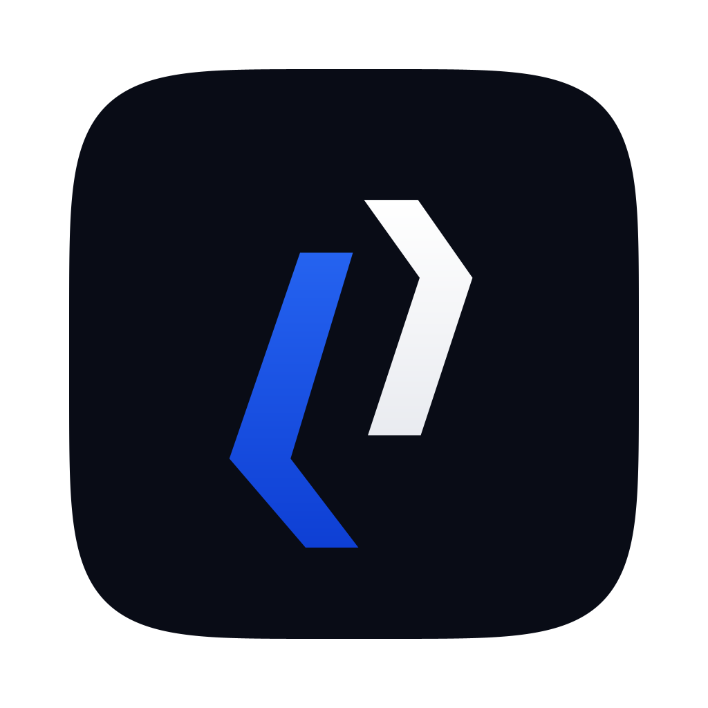

<p align="center">
  
</p>

<h1 align="center">DigiDev</h1>

<p align="center">
  A code editor by <a href="https://github.com/digipacket-net">Digipacket</a>,<br>
  built for local PHP and WordPress work — without Docker.
</p>

<p align="center">
  <a href="https://github.com/digipacket-net/digidev-app/releases/latest"><b>Download the latest version</b></a>
</p>

<p align="center">
  <b>English</b> · <a href="README.fr.md">Français</a>
</p>

---

## What it is

A full editor that also knows how to stand up a local development stack and
work inside it. Fill in one form and it installs WordPress, Laravel, Symfony or
a Node server, creates the database, and writes the configuration against the
local server.

It also connects to your hosting, brings a live site down to your machine, and
afterwards sends back only the files you actually changed.

## Install

**You need an Intel Mac running macOS 12 (Monterey) or later.** Apple Silicon
(M1 and later) is not covered yet, and neither is Windows.

1. Download the `.zip` from [the latest release](https://github.com/digipacket-net/digidev-app/releases/latest).
2. Open it, then drag **DigiDev** into your *Applications* folder.
3. **Open Terminal and run this line:**

   ```sh
   xattr -dr com.apple.quarantine /Applications/DigiDev.app
   ```

4. Launch DigiDev normally.

### Why that third step

The application is not signed by Apple. Without this command macOS says
*"DigiDev is damaged and can't be opened"* — a misleading message: the
application is not damaged, it is simply unknown to Apple, which costs $99 a
year to change.

The command removes the flag macOS attaches to anything downloaded from the
internet. It does not modify the application and it does not turn off any
system protection.

Only run it on a file whose origin you know — here, this repository's Releases
page.

## First steps

### Stand up a site

Click **Project Launcher** in the side bar, pick a recipe, fill in the form.

| Recipe | What you get | What you need installed |
| --- | --- | --- |
| **WordPress** | The latest release, its database, and `wp-config.php` written against the local server | PHP 7.4 or newer |
| **Laravel** | A new Laravel application, `.env` written, application key generated, first migrations run | PHP 8.2 or newer, [Composer](https://getcomposer.org) |
| **Symfony** | A new Symfony application, `.env.local` written, optionally the full web application pack | PHP 8.2 or newer, [Composer](https://getcomposer.org) |
| **Node starter** | A small Express server, in JavaScript or TypeScript, with its dependencies installed | [Node.js](https://nodejs.org) 20.6 or newer |

DigiDev never asks you to type database credentials into a config file: it
writes what it actually created, so nothing is stale the first time the server
moves.

The PHP recipes send mail nowhere real — Laravel to its log, Symfony to a null
mailer. A local copy of a site should not be able to send a password reset to an
actual customer by accident.

**DigiDev does not install PHP or MySQL.** It finds what is already on your
machine — DBngin, Herd, MAMP, XAMPP, Homebrew — and runs *its own* instance, on
*its own* ports, against *its own* data directory. Your existing installation is
never touched and never reconfigured.

If you have none of those, install [DBngin](https://dbngin.com) first — it is
the simplest, and free.

Then right-click the site: **Start the local server**, then **Open the site in a
browser**.

Deleting a site deletes its database too. Nothing about it is irreversible: the
database is dumped into the site folder first, the folder goes to the Trash, and
only then is the database dropped.

### Work on a site that is already live

Open the **Hosting** panel, then **Add Hosting Account** — FTP or SFTP.

Your credentials are encrypted by the macOS keychain. They are **never** written
in clear text into settings files, so they can never be pushed to a repository
by accident.

Once connected:

| Command | What it does | Where to find it |
| --- | --- | --- |
| **Import the Site Locally** | brings the site down into a folder of your choosing | Hosting panel |
| **Deploy Changed Files** | sends back **only** what you changed | the button at the bottom right, or right-click the project folder |
| **Deploy This File** | sends back the open file | the file's tab, or right-click it |
| **Deploy Every File** | sends everything, no comparison | right-click the project folder |

Once you are connected, a button appears at the **bottom right** with the name
of your hosting account. Edit your files, click it, and DigiDev tells you what
it is about to send before it sends anything.

#### A folder you already had

If the local folder did not come from **Import the Site Locally**, DigiDev has
no idea where it belongs on the server — so it would send your files to
wherever the server drops you on login, usually one level above the site.

Tell it once:

1. Open your local folder and connect to the account.
2. In **Remote files**, browse to the site's folder — the one that contains
   `index.php` or `wp-content`.
3. Click the **link** icon next to it: *Link This Folder to the Site*.

From then on the deploy button sends there. Nothing is downloaded and nothing
on the server is touched when you link.

The **first** deploy after linking sends every file, not just the ones you
changed. DigiDev has not seen what is on the server and will not assume your
copy matches it — assuming that would mean silently skipping the files that
actually differ. Deployments after the first are incremental.

#### Sending on every save

Turn on **`digidev.hosting.deployOnSave`** in Settings and each save goes
straight to the server.

It only works on a linked folder, and it is off by default for a reason: it
writes to a live site with no confirmation. Leave it off while you are working
on something that is serving real visitors.

The first deploy after an import sends nothing: DigiDev recorded what it brought
down, and compares file contents rather than timestamps. Change one file, and
that file — only that file — is what goes back up.

**Server log** is the third view in that panel. When a transfer fails, the
reason is at the top of it — newest line first. Your password never appears
there, even when a server quotes your failed login back at it.

### Let an agent work on the project

**AI Agents**, in the Activity Bar, applies a specialised skill to the open
project and shows you what it wants to change before anything changes.

1. Click an agent — **SEO Agent** or **Security Agent** to start with.
2. The first time, DigiDev asks which assistant should do the work: Claude
   Code, OpenAI Codex or Gemini CLI. It must be installed and signed in on
   your Mac; if it is not, DigiDev opens the install page or a terminal with
   the sign-in command. **DigiDev never asks for a key and never holds one** —
   the assistant's own tool keeps its own session.
3. The agent works on a **copy** of your project. Your files are not on its
   path at all.
4. When it finishes, its report opens beside the editor and **Proposed
   changes** lists every file it wants to change. Click one to see the
   difference; **Apply** or **Discard** each, or all at once.

The Security Agent scans, reports by severity, and **asks permission** before
fixing anything. Answer with **Reply to the Agent** — it continues the same
conversation on the same copy, and only then is there a diff to review.

Your own agents go in `~/.digidev/agents/<name>/`: a `SKILL.md` and, if you
want a title or icon, an `agent.json`.

### Share a skill with every assistant

A **skill** is a folder of instructions an AI assistant reads before doing a
particular job — reviewing a theme, writing a migration, following your house
style. Claude Code calls them skills; Codex and Gemini have no such thing, and
read a single file at the root of the project instead.

**Project Launcher → Skills** hides that difference.

1. **Import a Skill** — point it at a folder or a `.zip`. It lands in your
   library at `~/.digidev/skills/`, where every project can reach it.
2. **Apply to This Project** — pick which assistants should see it. The skill is
   written once to `.claude/skills/<name>/`, and the assistants that cannot read
   a skill folder are pointed at that copy from `AGENTS.md` and `GEMINI.md`.
3. **Make Available in Every Project** — copies it to `~/.claude/skills/`, which
   is where Claude Code looks for skills that apply everywhere.

Anything you wrote by hand in `AGENTS.md` or `GEMINI.md` is left alone. DigiDev
only ever rewrites what is between its own two marker comments, so applying a
second skill updates that block instead of adding another one, and removing the
last skill takes the block with it.

A skill without a `description` in its `SKILL.md` is refused. Without one, an
assistant has no way to know when the skill applies — it would look installed
and do nothing.

### Add extensions

Two routes, and neither goes through a marketplace.

**The list in the Extensions panel** offers a chosen set taken from
[Open VSX](https://open-vsx.org), grouped so you can find what you came for:

| Group | What is in it |
| --- | --- |
| **AI** | ChatGPT, Gemini Code Assist |
| **PHP** | Intelephense, DocBlocker, namespace resolver |
| **Laravel** | Blade syntax, extra IntelliSense |
| **Web** | Prettier, ESLint, Tailwind, auto rename tag, Live Server |
| **Tools** | GitLens, Error Lens, EditorConfig, Path IntelliSense, dotenv, YAML, spell checker |

Each one installs and uninstalls from that list — no marketplace account, no
`.vsix` to find. Every download is checked against the `sha256` the registry
publishes; if it does not match, the file is deleted instead of installed.

To add your own, put a file at `~/.digidev/extensions.json`:

```json
{ "extensions": [{ "id": "publisher.name", "group": "Mine", "note": "why" }] }
```

**A `.vsix` file** of your own: `Extensions: Install from VSIX…` from the
command palette (`⇧⌘P`).

### Already included

* **Claude Code** — Anthropic's official extension, unmodified. It needs the
  `claude` CLI installed and signed in on your machine.
* **PHP Debug** (`xdebug.php-debug`) — so *Run and Debug* has an answer on a PHP
  file.

## Updating

There is no automatic update yet. Download the new version, replace the
application in *Applications*, and run the `xattr` command again.

Your settings, extensions and sites live outside the application — in
`~/.digidev` — and survive the replacement.

## What DigiDev does not do

* **No marketplace.** DigiDev defines no extension gallery and never contacts
  Microsoft's.
* **No Copilot.** Removed from the product.
* **No telemetry to Microsoft.**

## Reporting a problem

[Open an issue](https://github.com/digipacket-net/digidev-app/issues) with your
macOS version and your DigiDev version (*DigiDev → About*).

## Licence

DigiDev is a fork of [Code - OSS](https://github.com/microsoft/vscode), which
Microsoft publishes under the MIT licence, and it keeps that licence.

It is **not** Visual Studio Code, and this project is not affiliated with,
endorsed by, or supported by Microsoft.

Copyright (c) 2015 - present Microsoft Corporation — for the Code - OSS source.
Copyright (c) 2026 Digipacket — for the changes.

Licensed under [MIT](LICENSE.txt).
